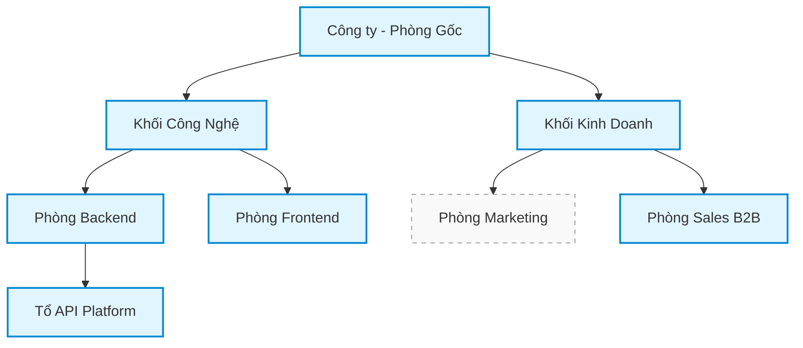

# Đặc tả Hệ Thống Mini HRM (System & Business Specifications)

Chỉ mục toàn bộ tài liệu đặc tả nghiệp vụ, kiến trúc và phân rã chức năng của **Mini HRM** — hệ thống Quản lý Phòng ban & Nhân viên theo cơ cấu phân cấp đa tầng.

Hệ thống: backend **Go** (tương thích kép: Standalone HTTP Server cục bộ & **AWS Lambda**), cơ sở dữ liệu **Amazon DynamoDB** (Single-Table Design với ít nhất 1 GSI), xác thực **AWS Cognito** (phiên lưu ở Cookie `HttpOnly`), frontend **Next.js (App Router)** + **TypeScript** + **Tailwind CSS** + **shadcn/ui**.

> **Triết lý của Mini HRM**: Một lát cắt dọc thu nhỏ của hệ thống thật: từ giao diện, qua API, xuống cơ sở dữ liệu và phân quyền. Hệ thống này không đo tốc độ gõ mã — nó đo cách bạn xử lý những chỗ dễ sai mà không ai báo lỗi. Toàn bộ hệ thống phải chạy được offline không cần tài khoản AWS.

---

## 1. Tám Ràng Buộc Bất Di Bất Dịch (Guaranteed Constraints)

Mỗi ràng buộc dưới đây được đúc kết trực tiếp từ sự cố thật đã xảy ra trong hệ thống vận hành của **OAlphaHub**. Vi phạm bất kỳ ràng buộc nào đều dẫn tới lỗi hệ thống nghiêm trọng hoặc lỗ hổng bảo mật tiềm tàng:

| # | Ràng buộc bắt buộc | Vì sao phải làm như vậy (Lý do kỹ thuật & rủi ro) |
| :--: | :--- | :--- |
| **1** | **Kẹp phạm vi là điều kiện truy vấn, không phải bộ lọc sau khi lấy dữ liệu về** | Lọc ở tầng ứng dụng (in-memory) nghĩa là dữ liệu ngoài quyền đã rời khỏi cơ sở dữ liệu và đã nằm trong bộ nhớ tiến trình. Vừa chậm lãng phí I/O, vừa là một lỗ rò chỉ chờ một dòng `log` sơ ý hay dump lỗi là lộ dữ liệu. Điều kiện phạm vi phải nằm ngay trong `KeyConditionExpression` hoặc `FilterExpression` của DynamoDB. |
| **2** | **Bản ghi ngoài phạm vi trả `404 Not Found`, không phải `403 Forbidden`** | Mã lỗi `403` ngầm thừa nhận: *"Có bản ghi này trong hệ thống, nhưng bạn không được xem"* — kẻ tấn công chỉ cần chạy script brute-force ID tuần tự là dò ra toàn bộ danh sách ID hồ sơ và cơ cấu tổ chức thật của công ty. `404` biến việc dò tìm thành vô nghĩa. |
| **3** | **Ghi nhật ký cùng giao dịch với ghi nghiệp vụ; nhật ký hỏng thì thao tác hỏng** | Ghi nhật ký sau nghiệp vụ, hoặc ngoài transaction nghĩa là có lúc dữ liệu đã đổi mà nhật ký ghi thất bại do lỗi mạng/crash. Khi đó dữ liệu đổi mà không ai biết ai đổi — và đó chính là lúc bạn cần nhật ký nhất (khi có sự cố hoặc tranh chấp). Trong DynamoDB, phải dùng `TransactWriteItems`. |
| **4** | **Không xóa cứng dữ liệu nghiệp vụ (No Hard Delete)** | Xóa cứng một phòng ban hoặc một nhân viên sẽ làm bốc hơi toàn bộ lịch sử công tác, vết chấm công, nhật ký phê duyệt và dòng tiền liên quan sau này. Phòng ban chỉ được chuyển trạng thái `ARCHIVED`, nhân viên chỉ chuyển trạng thái `RESIGNED`. |
| **5** | **Khóa lạc quan (OCC): hai người sửa cùng một bản ghi thì người sau phải nhận xung đột** | Không có khóa lạc quan (`version` check trong `ConditionExpression`), bản ghi ghi sau sẽ âm thầm đè bẹp bản ghi ghi trước (Lost Update). Không có lỗi, không có cảnh báo — người dùng thứ nhất chỉ thấy thay đổi tâm huyết của mình biến mất vài phút sau. |
| **6** | **Mọi POST nhận `Idempotency-Key` và gửi lại cùng khóa không tạo bản ghi thứ hai** | Người dùng bấm đúp khi mạng lag, hoặc trình duyệt gửi lại do timeout là chuyện thường ngày, không phải ngoại lệ. Thiếu tính lũy kế (Idempotency) sẽ tạo ra bản ghi nhân viên trùng lặp hoặc phòng ban rác. |
| **7** | **DynamoDB một bảng với ít nhất một GSI; README giải thích thiết kế khóa** | Người quen tư duy SQL sẽ tạo nhiều bảng rồi dùng `Scan` để join trong code. Đó là cách biến DynamoDB thành một CSDL quan hệ vừa chậm vừa cực kỳ đắt đỏ. Single-table design gom thực thể vào cùng 1 bảng với Partition Key (`PK`), Sort Key (`SK`) và GSI tối ưu cho truy vấn phân cấp. |
| **8** | **Mỗi màn hình có dữ liệu xử lý đủ sáu trạng thái** | Sáu trạng thái bắt buộc: **Đang tải (Loading)** · **Rỗng (Empty)** · **Lỗi (Error)** · **Không có quyền (Forbidden/404)** · **Đang lưu (Saving/Submitting)** · **Mất kết nối (Offline/Network Error)**. Hai trạng thái luôn bị bỏ quên là *không có quyền* và *mất kết nối* — và cả hai chỉ lộ ra khi hệ thống đã chạy thật. |

---

## 2. Ba Cạm Bẫy Chí Mạng (Critical Traps)

Trước khi viết dòng mã đầu tiên, kỹ sư bắt buộc phải nắm vững ba vị trí này — đây là nơi hệ thống có thể tự phá vỡ cấu trúc hoặc mở toang lỗ hổng bảo mật:

```
                    ┌──────────────────────────────────────────────┐
                    │          3 CẠM BẪY CHÍ MẠNG                  │
                    └──────────────────────┬───────────────────────┘
                                           │
         ┌─────────────────────────────────┼─────────────────────────────────┐
         ▼                                 ▼                                 ▼
   [Cạm bẫy 1]                       [Cạm bẫy 2]                       [Cạm bẫy 3]
Chu trình đệ quy cây             Cập nhật cây con &                Leo thang đặc quyền
(BR-PB-04)                       DynamoDB Transact Limit           Trưởng phòng (Role Matrix)
Chuyển cha vào cây con           Di chuyển phòng ban nhánh lớn     Chuyển người sang phòng khác
--> Treo duyệt vô hạn,           --> Vượt trần 100 items/tx        --> Tự ý mở rộng phạm vi
    sập server                       của DynamoDB                      quản lý của chính mình
```

### Cạm bẫy 1: Di chuyển phòng ban vào chính nó hoặc cây con của nó (`BR-PB-04`)
Cho phép đưa *"Khối Công nghệ"* xuống dưới *"Phòng Backend"* — vốn là con của nó — sẽ tạo ra một vòng lặp kín (chu trình đệ quy). 
- **Hệ quả**: Mọi thuật toán duyệt cây, render menu phân cấp sẽ chạy vô hạn gây treo trình duyệt; hàm tính `path` bị đệ quy tràn bộ nhớ; phạm vi phân quyền trở thành vô nghĩa. 
- **Đặc điểm**: Không có bất kỳ bản ghi nào nhìn sai lệch — thứ hỏng hoàn toàn là tính toàn vẹn của cấu trúc đồ thị.

### Cạm bẫy 2: Cập nhật `path` cây con và giới hạn DynamoDB Transaction (`UC-02`)
Khi di chuyển một phòng ban, toàn bộ cây con bên dưới nó phải được cập nhật lại chuỗi dẫn xuất `path` (`BR-PB-05`).
- **Thách thức**: DynamoDB giới hạn tối đa **100 thao tác** (hoặc giới hạn dung lượng 4MB) trong một lệnh `TransactWriteItems`. Một phòng ban có 30 phòng con và 200 nhân sự liên đới sẽ không thể nhét vừa vào một transaction đơn lẻ.
- **Yêu cầu bắt buộc**: Phải có chiến lược xử lý tường minh: chặn kích thước tối đa cây con, chia lô (chunking) kèm trạng thái trung gian, hoặc cơ chế bọc transaction phù hợp và ghi rõ quyết định vào tài liệu kiến trúc.

### Cạm bẫy 3: Trưởng phòng cố ý KHÔNG được chuyển người sang phòng khác
Nếu Trưởng phòng được phép đổi phòng ban của một nhân sự, họ có thể chuyển một nhân viên bất kỳ trong công ty vào cây con của mình, sau đó dùng quyền Trưởng phòng để xem và sửa hồ sơ người đó.
- **Hệ quả**: Đây là lỗ hổng **leo thang đặc quyền kinh điển (Privilege Escalation)**. Quyền chuyển phòng ban (`UC-03`) do đó được khóa cứng chỉ dành riêng cho **Quản trị viên (Admin)**.

---

## 3. Chỉ Mục Bộ Tài Liệu Đặc Tả Nghiệp Vụ

Tài liệu được phân chia theo tiêu chuẩn module hóa của dự án Nephien, bảo đảm tính nhất quán từ nghiệp vụ đến mã nguồn:

| Nhóm tài liệu | File | Phạm vi & Nội dung chính |
| :--- | :--- | :--- |
| **Hệ thống thiết kế** | [design-system.md](design-system.md) | Design tokens, bảng màu, typography, 6 trạng thái UI, component specs cho Stitch & Tailwind |
| **Kiến trúc & Công nghệ** | [tech-stack.md](tech-stack.md) | Bộ công nghệ chính thức, kiến trúc Go Standalone vs Lambda, DynamoDB Local, Cognito Adapter |
| **Đặc tả miền tổng quan** | [tong-quan-nghiep-vu.md](tong-quan-nghiep-vu.md) | Bối cảnh doanh nghiệp 200–500 người, Ubiquitous Language, Class Diagram, thiết kế khóa DynamoDB, State Machines |
| **Phân hệ Phòng ban** | [specs/phong-ban-spec.md](specs/phong-ban-spec.md) | Quản lý cây tổ chức, quy tắc `BR-PB-01..08`, Use Case `UC-01` (Tạo), `UC-02` (Di chuyển cây con & thuật toán path) |
| **Phân hệ Nhân viên** | [specs/nhan-vien-spec.md](specs/nhan-vien-spec.md) | Quản lý hồ sơ, quy tắc `BR-NV-01..06`, Use Case `UC-03` (Chuyển phòng), `UC-04` (Nghỉ việc/xóa mềm), chính sách giữ email |
| **Định danh & Phân quyền** | [specs/phan-quyen-va-kep-pham-vi-spec.md](specs/phan-quyen-va-kep-pham-vi-spec.md) | 3 vai trò, kẹp phạm vi động `BR-PV-01..04`, ma trận quyền 12 thao tác, nguyên tắc bảo mật `404` thay vì `403` |
| **Kiểm toán & Ngoại lệ** | [specs/nhat-ky-va-tinh-huong-bien-spec.md](specs/nhat-ky-va-tinh-huong-bien-spec.md) | Sổ nhật ký chỉ ghi thêm, khóa lạc quan `version`, `Idempotency-Key`, 9 tình huống biên `EC-01..09`, dữ liệu mẫu tối thiểu |

---

## 4. Dữ Liệu Mẫu Tối Thiểu Để Kiểm Thử Nghiệp Vụ (Seed Data)

Để chứng minh cơ chế kẹp phạm vi (Data Scoping) hoạt động chính xác trong các bài kiểm thử tự động, hệ thống yêu cầu cấu trúc dữ liệu mẫu tối thiểu:



**Các yêu cầu bắt buộc của bộ dữ liệu:**
1. Cây phòng ban có độ sâu ít nhất **3 cấp**, với tối thiểu **2 nhánh song song** độc lập (ví dụ: Khối Công nghệ vs Khối Kinh doanh).
2. Mỗi nhánh có từ **3 nhân viên** trở lên.
3. Cơ cấu tài khoản:
   - **1 Quản trị viên (Admin)**: Thấy toàn bộ cây công ty.
   - **2 Trưởng phòng ở hai nhánh khác nhau**: Ví dụ Trưởng phòng Backend và Trưởng phòng Sales B2B. Khi Trưởng phòng này truy vấn, tuyệt đối không được thấy nhân viên của nhánh kia.
   - **1 Nhân viên thường**: Chỉ thấy duy nhất hồ sơ của chính mình.
4. Có ít nhất **1 phòng ban đã lưu trữ (`ARCHIVED`)** và **1 nhân viên đã nghỉ việc (`RESIGNED`)** để kiểm thử logic xóa mềm và bộ lọc.

> [!CAUTION]
> **Hai trưởng phòng ở hai nhánh khác nhau là điều kiện bắt buộc.** Nếu chỉ tạo một Trưởng phòng trong bộ dữ liệu test, mọi truy vấn đều có thể trả về đúng ngẫu nhiên dù bạn có kẹp phạm vi hay không — khi đó bộ test sẽ "xanh một cách vô nghĩa".
