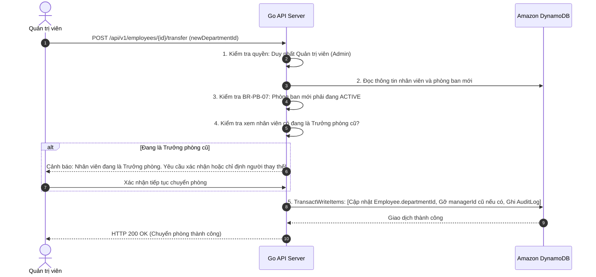
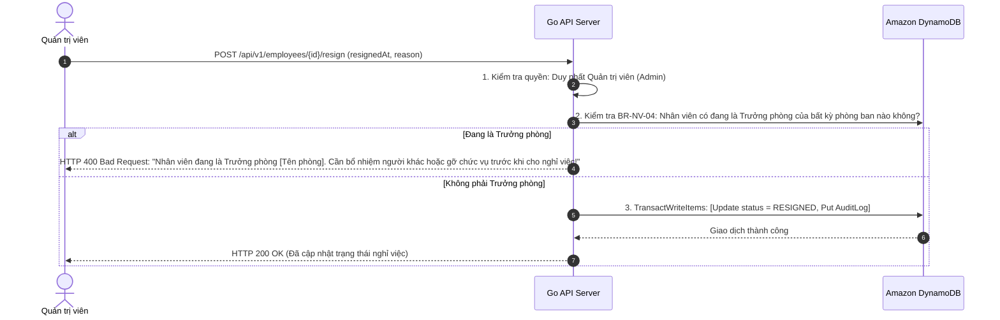

# Đặc Tả Chức Năng — Phân Hệ Quản Lý Nhân Viên (Employee Spec)

## 1. Tổng Quan Phân Hệ

Phân hệ Nhân viên chịu trách nhiệm quản lý hồ sơ nhân sự, lịch sử công tác, tiếp nhận nhân sự mới, điều chuyển phòng ban và quy trình cho thôi việc (nghỉ việc).

Trong Mini HRM, thực thể **Nhân viên (`Employee`)** có mối quan hệ chặt chẽ với cơ cấu tổ chức:
- Mỗi nhân viên tại một thời điểm bắt buộc phải trực thuộc **đúng một phòng ban đang hoạt động**.
- Vị trí của nhân viên trong cây phòng ban là căn cứ trực tiếp để tính toán quyền hạn (nếu được bổ nhiệm làm Trưởng phòng) hoặc chịu sự quản lý của cấp trên theo cơ chế Kẹp phạm vi (Data Scoping).

---

## 2. Danh Mục Quy Tắc Nghiệp Vụ (Business Rules)

Mỗi quy tắc dưới đây giải quyết một rủi ro thực tế trong quản trị nhân sự và **bắt buộc phải có Unit/Integration Test tương ứng**:

| Mã quy tắc | Tên quy tắc nghiệp vụ | Mô tả chi tiết & Hành vi hệ thống | Vì sao & Phân tích rủi ro thực tế |
| :--- | :--- | :--- | :--- |
| **BR-NV-01** | **Bảo lưu email vĩnh viễn (kể cả đã nghỉ việc)** | Địa chỉ `email` là duy nhất trên toàn công ty. Một email đã từng được sử dụng **tuyệt đối không bao giờ được phép cấp phát lại cho một người mới**, kể cả khi chủ nhân cũ đã nghỉ việc hàng chục năm. | **Điểm chủ ý quan trọng**: Nếu thả email ra cho người mới dùng lại, từ thời điểm đó về sau toàn bộ dữ liệu lịch sử, chữ ký số, vết phê duyệt, nhật ký kiểm toán trong quá khứ liên quan tới email đó sẽ trỏ nhầm sang người mới. Sự cố này chỉ bộc lộ sau nhiều tháng hoặc nhiều năm, đúng vào lúc có tranh chấp pháp lý hoặc thanh tra tài chính cần tra cứu dữ liệu gốc nhất. |
| **BR-NV-02** | **Trực thuộc đúng một phòng ban `ACTIVE`** | Tại mọi thời điểm, mỗi nhân viên bắt buộc phải thuộc về đúng một phòng ban duy nhất và phòng ban đó **phải đang ở trạng thái `ACTIVE`**. | Ngăn chặn tình trạng nhân viên "vô gia cư" trên sơ đồ tổ chức, hoặc trực thuộc một phòng ban "ma" đã bị giải thể/lưu trữ. |
| **BR-NV-03** | **Xóa mềm khi nhân viên nghỉ việc** | Khi nhân viên thôi việc, hệ thống chỉ cập nhật trạng thái `status = "RESIGNED"`. **Tuyệt đối không xóa dòng dữ liệu (Hard Delete) khỏi DynamoDB**. | Bảo toàn toàn vẹn lịch sử công tác và dữ liệu liên kết với các phân hệ khác (chấm công, tính lương, KPI, nhật ký hệ thống). |
| **BR-NV-04** | **Chặn nghỉ việc đối với Trưởng phòng đương nhiệm** | Một nhân viên đang giữ vị trí Trưởng phòng (`Department.managerId == Employee.id`) **không được phép cho nghỉ việc**, cho tới khi vị trí đó được chuyển giao cho người khác hoặc được gỡ bỏ về trạng thái rỗng. | Tránh tình trạng một phòng ban đang hoạt động nhưng người đứng đầu trên hệ thống lại là một nhân sự đã nghỉ việc, làm tê liệt quy trình phê duyệt cấp phòng. |
| **BR-NV-05** | **Ghi nhật ký chi tiết khi chuyển phòng ban** | Mọi thao tác điều chuyển phòng ban bắt buộc phải sinh một bản ghi `AuditLog` ghi rõ **phòng ban xuất phát (from)** và **phòng ban đích (to)**. | Đáp ứng yêu cầu truy vết biến động nhân sự phục vụ thanh tra nội bộ và tính lương luân chuyển. |
| **BR-NV-06** | **Giới hạn ngày vào làm (`joinedAt`)** | Trường ngày vào làm (`joinedAt`) **không được phép muộn hơn ngày hiện tại quá 90 ngày**. | **Lưới chắn lỗi gõ phím**: Quy tắc này không phải luật lao động mà là cơ chế phòng thủ giao diện. Người dùng gõ nhầm năm tương lai (ví dụ `2027` thay vì `2026`) sẽ tạo ra một hồ sơ hợp lệ về mặt định dạng ngày tháng nhưng sai lệch hoàn toàn về mặt nghiệp vụ và báo cáo thâm niên. |

---

## 3. Đặc Tả Luồng Nghiệp Vụ Chính

### 3.1. UC-03 · Chuyển Phòng Ban Cho Nhân Viên

#### Các bước thực hiện:
1. **Người thực hiện**: **Duy nhất Quản trị viên (Admin)**. 
   *(Trưởng phòng cố ý không có quyền này để chống lỗ hổng leo thang đặc quyền)*.
2. Người dùng chọn nhân viên cần chuyển và chọn phòng ban đích mới.
3. Máy chủ Go kiểm tra phòng ban mới phải đang ở trạng thái `ACTIVE` (`BR-PB-07`). Nếu chuyển vào phòng đã `ARCHIVED` -> **Từ chối ngay lập tức**.
4. Máy chủ kiểm tra xem nhân viên này có đang là Trưởng phòng của phòng ban hiện tại hay không:
   - Nếu có: Hệ thống cảnh báo rõ ràng trên giao diện, yêu cầu xác nhận. Khi xác nhận, hệ thống tự động gỡ `managerId` của phòng cũ về rỗng (hoặc yêu cầu chọn người thay thế).
5. Thực hiện cập nhật `departmentId` của nhân viên sang phòng mới và ghi một bản ghi `AuditLog` (`action = "employee.transferred"`, lưu rõ ID phòng cũ và ID phòng mới trong `before`/`after`) trong cùng một giao dịch.

#### Tiêu chí nghiệm thu (Acceptance Criteria):
- [ ] Chuyển nhân viên vào một phòng ban đang bị `ARCHIVED`: Bị từ chối.
- [ ] Bản ghi `AuditLog` ghi nhận chính xác: ID phòng ban cũ và ID phòng ban mới.
- [ ] Trưởng phòng cũ và Trưởng phòng mới mở lại danh sách nhân sự của mình: Danh sách nhân viên lập tức thay đổi phản ánh vị trí mới mà không cần đăng nhập lại.

---

### 3.2. UC-04 · Cho Nhân Viên Nghỉ Việc (Xóa Mềm)

#### Các bước thực hiện:
1. **Người thực hiện**: Quản trị viên (Admin).
2. Quản trị viên chọn nhân viên và nhập ngày chính thức nghỉ việc.
3. Máy chủ kiểm tra quy tắc `BR-NV-04`:
   - Quét xem có phòng ban nào đang có `managerId == employee.id` hay không.
   - Nếu có: **Từ chối ngay lập tức**, thông báo rõ ràng nhân viên này đang làm Trưởng phòng của phòng ban nào và hướng dẫn Quản trị viên cần bổ nhiệm người khác hoặc xóa ô trưởng phòng trước.
4. Nếu hợp lệ: Cập nhật `status = "RESIGNED"`, ghi nhận `AuditLog` (`action = "employee.resigned"`).

#### Tiêu chí nghiệm thu (Acceptance Criteria):
- [ ] Cho thôi việc một nhân viên đang là Trưởng phòng: Bị từ chối, thông báo lỗi chỉ đích danh phòng ban đang phụ trách.
- [ ] Sau khi nghỉ việc: Nhân viên không còn xuất hiện trong danh sách nhân sự mặc định (chỉ xuất hiện khi bật bộ lọc *"Đã nghỉ việc"*).
- [ ] Email của nhân viên đã nghỉ việc: **Vẫn bị khóa trong hệ thống**. Thao tác tạo nhân viên mới sử dụng lại email này sẽ bị từ chối (`BR-NV-01`).
- [ ] Bản ghi hồ sơ nhân viên và lịch sử công tác vẫn còn nguyên vẹn trong DynamoDB, không bị mất mát dữ liệu.

---

### 3.3. Tiếp Nhận & Quản Lý Hồ Sơ Nhân Sự

#### Tạo mới nhân viên (`Create Employee`):
- **Phân quyền**: Quản trị viên.
- **Quy tắc validate**:
  - `code`: Chuỗi duy nhất, bất biến.
  - `fullName`: 2–100 ký tự.
  - `email`: Chuỗi email chuẩn, kiểm tra duy nhất trên toàn hệ thống (`BR-NV-01`).
  - `departmentId`: Phòng ban chỉ định phải đang `ACTIVE`.
  - `joinedAt`: Không được vượt quá ngày hiện tại + 90 ngày (`BR-NV-06`).

#### Chỉnh sửa hồ sơ nhân sự (`Update Profile`):
- **Phân quyền**: Quản trị viên (sửa bất kỳ ai); Trưởng phòng (chỉ sửa được nhân viên thuộc phòng mình và các phòng con bên dưới). Nhân viên thường không được sửa hồ sơ.
- **Quy tắc**: Không được sửa các trường bất biến: `id`, `code`, `email`. Cập nhật phiên bản `version = version + 1` phục vụ khóa lạc quan (OCC).

#### Xem danh sách nhân sự & Tìm kiếm:
- Hỗ trợ tìm kiếm theo tên, mã nhân viên, chức danh.
- Lọc theo phòng ban và trạng thái (`ACTIVE`, `RESIGNED`).
- Phân trang dữ liệu (Pagination) bằng token `LastEvaluatedKey` của DynamoDB.
- **Bắt buộc áp dụng bộ kẹp phạm vi (Data Scoping)** ở mức câu truy vấn cơ sở dữ liệu.
