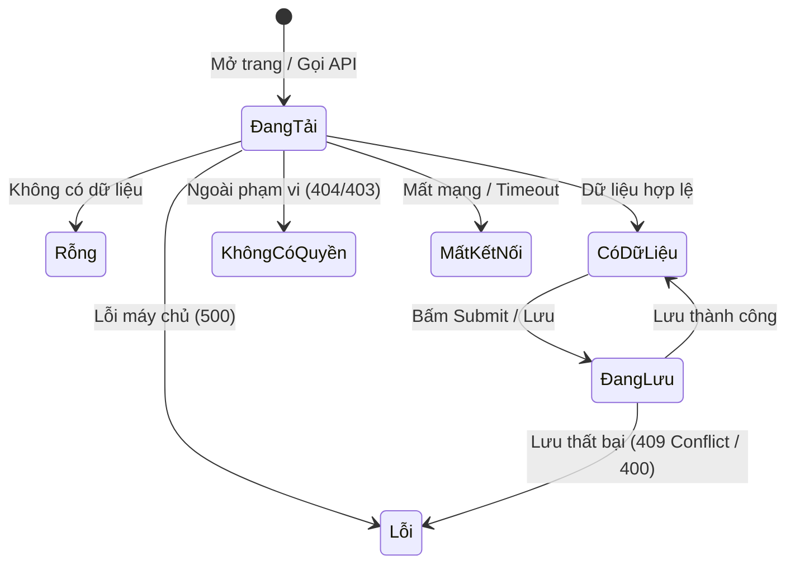

# Đặc Tả Chức Năng — Nhật Ký Kiểm Toán & Các Tình Huống Biên (Audit & Edge Cases)

## 1. Phân Hệ Nhật Ký Kiểm Toán (Audit Log)

### 1.1. Triết Lý & Bất Biến Của Nhật Ký

Nhật ký trong Mini HRM là sổ cái lưu lại toàn bộ diễn biến thay đổi trong hệ thống: **Ai đổi gì — Lúc nào — Với giá trị trước và sau như thế nào**.

> [!CAUTION]
> **NHẬT KÝ LÀ SỔ CÁI CHỈ GHI THÊM (APPEND-ONLY).**
> Tuyệt đối không có API sửa, không có lệnh xóa. Một bảng nhật ký có thể chỉnh sửa hoặc xóa được là một bảng nhật ký hoàn toàn vô giá trị về mặt pháp lý và không thể chứng minh được điều gì khi xảy ra sự cố.

### 1.2. Ràng Buộc 3: Ghi Nhật Ký Cùng Giao Dịch Nghiệp Vụ

> [!IMPORTANT]
> **Ghi nhật ký cùng giao dịch với ghi nghiệp vụ; nhật ký hỏng thì thao tác hỏng.**
> Nếu hệ thống thực hiện cập nhật phòng ban/nhân viên trước, rồi sau đó mới gọi lệnh ghi nhật ký riêng lẻ ở bước sau (ngoài transaction):
> - Khi máy chủ bị crash, đứt mạng, hoặc DynamoDB quá tải ở lệnh thứ hai, dữ liệu nghiệp vụ đã thay đổi nhưng không hề có dòng nhật ký nào được ghi lại.
> - Khi đó, hệ thống rơi vào trạng thái: *"Dữ liệu bị đổi mà không ai biết ai đổi"* — và đó chính xác là lúc doanh nghiệp cần nhật ký kiểm toán nhất (để điều tra sự cố hoặc quy trách nhiệm).
> 
> **Giải pháp bắt buộc**: Thao tác ghi dữ liệu và thao tác ghi `AuditLog` bắt buộc phải được bọc chung trong duy nhất một lệnh `TransactWriteItems` của DynamoDB. Nếu thao tác ghi nhật ký gặp lỗi, toàn bộ thao tác nghiệp vụ phải tự động rollback hoàn toàn.

### 1.3. Cấu Trúc Ảnh Chụp (Snapshot) `before` và `after`
Để tiết kiệm chi phí lưu trữ DynamoDB và tối ưu hóa tốc độ đọc:
- Trường `before` và `after` **chỉ lưu các thuộc tính có sự thay đổi thật sự**.
- Ví dụ khi đổi tên phòng ban từ *"Kỹ thuật"* sang *"Công nghệ Thông tin"*:
  ```json
  {
    "action": "department.renamed",
    "targetId": "dept_123",
    "before": { "name": "Kỹ thuật" },
    "after": { "name": "Công nghệ Thông tin" }
  }
  ```

---

## 2. Khóa Lạc Quan (Optimistic Concurrency Control - OCC)

### 2.1. Ràng Buộc 5: Ngăn Chặn Ghi Đè Ngầm (Lost Updates)
Khi hai Quản trị viên cùng mở màn hình chỉnh sửa cùng một phòng ban hoặc cùng một hồ sơ nhân viên tại một thời điểm:
- Không có khóa lạc quan: Người bấm lưu sau sẽ âm thầm đè bẹp thay đổi của người lưu trước mà không có bất kỳ cảnh báo nào. Người thứ nhất chỉ thấy công sức nhập liệu của mình biến mất vài phút sau đó.

### 2.2. Cơ Chế Triển Khai Với Trường `version`
1. Mọi thực thể (`Department`, `Employee`) đều sở hữu trường số nguyên `version`, bắt đầu từ 1.
2. Khi máy khách tải dữ liệu về, giao diện lưu giữ giá trị `version` hiện tại.
3. Khi gửi yêu cầu cập nhật, máy khách đính kèm `version` đang có.
4. Lệnh ghi DynamoDB sử dụng `ConditionExpression`:
   ```text
   ConditionExpression: "attribute_exists(PK) AND version = :expectedVersion"
   ```
5. Nếu phiên bản trong CSDL đã bị người khác tăng lên trước, DynamoDB sẽ ném lỗi `ConditionalCheckFailedException`. Máy chủ Go lập tức phản hồi mã lỗi HTTP **`409 Conflict`** về cho người dùng thứ hai, kèm thông điệp: *"Dữ liệu đã được người khác cập nhật. Vui lòng tải lại trang trước khi chỉnh sửa!"*.

---

## 3. Tính Lũy Kế Cho Mọi Thao Tác POST (Idempotency)

### 3.1. Ràng Buộc 6: Tiêu Chuẩn `Idempotency-Key`
Khi mạng chập chờn hoặc người dùng sốt ruột bấm đúp chuột hai lần liên tiếp vào nút *"Tạo nhân viên"* hoặc *"Tạo phòng ban"*:
- Máy khách Next.js tự động sinh một mã định danh ngẫu nhiên (UUIDv4) và gắn vào HTTP Header:
  ```http
  Idempotency-Key: 7b8c2d1e-9a3f-4e5c-b1d2-8a9c0e1f2a3b
  ```
- Máy chủ Go lưu trữ `Idempotency-Key` vào một partition riêng trong DynamoDB kèm theo kết quả phản hồi ban đầu và đặt thời gian sống (TTL = 24 giờ).
- Nếu nhận được một yêu cầu POST thứ hai mang cùng `Idempotency-Key`: Hệ thống **không tạo thêm bản ghi thứ hai**, mà trả về ngay lập tức kết quả đã xử lý của lần gọi trước.

---

## 4. Chuẩn Hóa 6 Trạng Thái Màn Hình Giao Diện (UI States)

### Ràng Buộc 8: Mỗi màn hình có dữ liệu bắt buộc phải xử lý đủ 6 trạng thái

Giao diện Next.js + Tailwind CSS + shadcn/ui phải hiện thực hóa đầy đủ 6 trạng thái sau trên mọi view danh sách/chi tiết:



| Trạng thái | Mã hiệu | Biểu hiện trên giao diện & Cách xử lý |
| :--- | :---: | :--- |
| **1. Đang tải (Loading)** | `STATE_LOADING` | Hiển thị Skeleton UI (khung xương mô phỏng) đúng kích thước bảng, không để màn hình trắng. |
| **2. Rỗng (Empty)** | `STATE_EMPTY` | Minh họa hình ảnh rỗng thân thiện, thông điệp rõ ràng (ví dụ: *"Phòng ban này hiện chưa có nhân viên"*), kèm nút hành động. |
| **3. Lỗi (Error)** | `STATE_ERROR` | Hiển thị thông báo lỗi cụ thể, mã lỗi kỹ thuật và nút *"Thử lại (Retry)"*. |
| **4. Không có quyền (Forbidden/404)** | `STATE_NO_ACCESS`| Thông báo *"Không tìm thấy bản ghi hoặc bạn không có quyền truy cập"* (tuân thủ nguyên tắc 404). |
| **5. Đang lưu (Saving)** | `STATE_SAVING` | Vô hiệu hóa (disable) nút bấm, hiển thị biểu tượng spinner quay tròn, chống bấm đúp chuột. |
| **6. Mất kết nối (Offline)** | `STATE_OFFLINE` | Banner cảnh báo màu vàng/đỏ trên đầu trang: *"Mất kết nối tới máy chủ. Vui lòng kiểm tra đường truyền"*, tự động thử kết nối lại. |

> **Hai trạng thái luôn bị bỏ quên là *Không có quyền* và *Mất kết nối*** — và cả hai chỉ lộ ra khi hệ thống đã chạy thật trong môi trường doanh nghiệp.

---

## 5. Bảng Danh Mục 9 Tình Huống Biên (Edge Cases)

Đây là những tình huống đặc biệt mà hệ thống dễ trả lời sai mà không hề báo lỗi:

| Mã | Tình huống biên thực tế | Hành vi bắt buộc phải xảy ra của hệ thống |
| :---: | :--- | :--- |
| **EC-01** | Hai Quản trị viên cùng mở và sửa một phòng ban tại cùng một thời điểm. | Người bấm lưu sau **phải nhận thông báo xung đột phiên bản (HTTP `409 Conflict`)**, tuyệt đối không được âm thầm ghi đè dữ liệu của người trước (`BR-PB-05`). |
| **EC-02** | Trưởng phòng bị Quản trị viên chuyển sang phòng ban khác trong lúc đang mở danh sách nhân viên. | Ở lượt gọi API kế tiếp (hoặc trong vòng tối đa 60 giây), hệ thống **phải trả về danh sách theo đúng phạm vi mới**, không cần người dùng phải đăng nhập lại (`BR-PV-04`). |
| **EC-03** | Người dùng cố tình gõ URL hoặc gọi API xem một hồ sơ nhân viên nằm ngoài phạm vi được phép của mình. | Máy chủ phản hồi mã lỗi **`404 Not Found`**, tuyệt đối **không trả về `403 Forbidden`** (ngăn chặn rà quét ID). |
| **EC-04** | Người dùng gửi lại một yêu cầu `POST` có cùng giá trị `Idempotency-Key` (do mạng lag hoặc bấm đúp). | Hệ thống **trả về kết quả cũ đã xử lý**, tuyệt đối không tạo thêm bản ghi thứ hai trong cơ sở dữ liệu. |
| **EC-05** | Quản trị viên thực hiện thao tác Lưu trữ một phòng ban hiện vẫn còn 3 nhân viên đang làm việc. | Hệ thống **từ chối thao tác (`BR-PB-06`)**, thông báo lỗi nêu đích danh họ tên của 3 nhân viên còn lại. |
| **EC-06** | Quản trị viên bổ nhiệm Trưởng phòng cho Phòng Backend là một nhân viên thuộc Khối Kinh doanh (nhánh khác). | Hệ thống **từ chối thao tác (`BR-PB-08`)**, chỉ cho phép chọn nhân viên thuộc chính phòng đó hoặc các phòng con bên dưới. |
| **EC-07** | Quản trị viên tạo nhân viên mới sử dụng email của một nhân viên đã thôi việc 2 năm trước. | Hệ thống **từ chối tạo mới (`BR-NV-01`)**, bảo lưu email cũ vĩnh viễn cho mục đích toàn vẹn lịch sử. |
| **EC-08** | Quản trị viên di chuyển một phòng ban khiến cho nhánh con sâu nhất của nó vượt quá 5 cấp độ phân cấp. | Hệ thống **từ chối ngay từ đầu trước khi ghi bất kỳ dữ liệu nào vào CSDL (`BR-PB-03`)**. |
| **EC-09** | Nhân viên thường cố tình vượt rào gọi thẳng vào API lấy danh sách nhân viên toàn công ty. | Hệ thống phản hồi **`403 Forbidden`**, hoặc trả về danh sách **chỉ chứa duy nhất bản ghi của chính họ** — tuyệt đối không bao giờ để lộ danh sách toàn công ty. |

---

## 6. Yêu Cầu Kịch Bản Kiểm Thử Tự Động (Test Strategy)

Toàn bộ 9 tình huống biên và các quy tắc nghiệp vụ phải được chứng minh bằng các bài kiểm thử tự động (Go tests).

### Kịch bản bắt buộc với 2 Trưởng phòng ở hai nhánh:
```go
func TestDataScoping_TwoManagersCrossBranches(t *testing.T) {
    // 1. Dựng cây tổ chức mẫu: Khối Công Nghệ vs Khối Kinh Doanh
    // 2. Tạo Trưởng phòng Tech và Trưởng phòng Sales
    // 3. Giả lập Trưởng phòng Tech gọi API GET /api/v1/employees
    // 4. Khẳng định (Assert): 
    //    - Trả về đầy đủ nhân viên Tech (phòng mình và phòng con)
    //    - Số lượng nhân viên Sales xuất hiện bằng ĐÚNG 0
    // 5. Thử truy vấn chi tiết 1 nhân viên Sales bằng ID: Phải nhận HTTP 404
}
```
