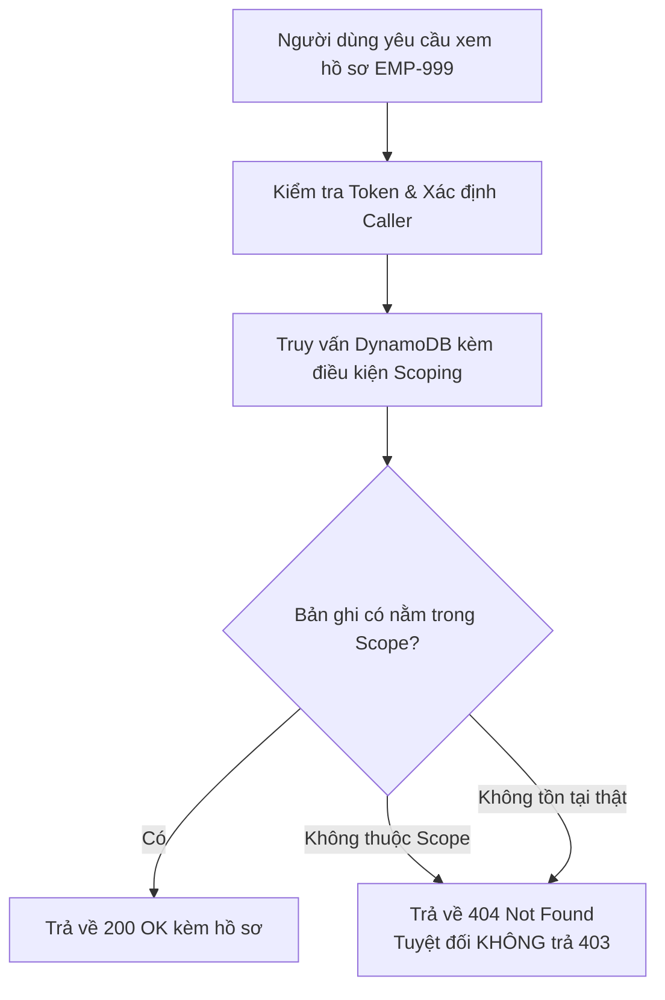

# Đặc Tả Chức Năng — Phân Hệ Định Danh, Phân Quyền & Kẹp Phạm Vi (Auth & Scoping Spec)

## 1. Tổng Quan Kiến Trúc Xác Thực & Danh Tính

Hệ thống Mini HRM tích hợp **AWS Cognito** làm nhà cung cấp dịch vụ định danh người dùng (Identity Provider). Kiến trúc bảo mật tuân thủ hai nguyên tắc thiết kế bất khả xâm phạm:

1. **Phiên đăng nhập lưu trữ tại Cookie `HttpOnly`**:
   - Token xác thực (JWT Access Token / ID Token) được lưu trong cookie trình duyệt với cờ `HttpOnly`, `Secure`, `SameSite=Strict`.
   - **Tuyệt đối không để token lọt xuống JavaScript trình duyệt** (tránh bị mã độc hoặc lỗ hổng XSS đánh cắp token).
2. **Cognito — Tách cổng ra khỏi bản cài (Interface Abstraction)**:
   - Định nghĩa một Interface xác thực trong mã nguồn Go.
   - Triển khai hai bản cài đặt: Một bản gọi AWS Cognito thật (khi chạy đám mây), một bản giả lập (Mock / Cognito Local) để chạy kiểm thử offline 100% không cần kết nối mạng.

---

## 2. Ba Vai Trò Cốt Lõi (Three Core Roles)

Hệ thống phân cấp người dùng thành 3 vai trò với ranh giới quyền hạn được phân định rõ rệt:

```
  ┌────────────────────────────────────────────────────────┐
  │                 QUẢN TRỊ VIÊN (Admin)                  │
  │                 Phạm vi: Toàn công ty                  │
  └───────────────────────────┬────────────────────────────┘
                              │
  ┌───────────────────────────▼────────────────────────────┐
  │                TRƯỞNG PHÒNG (Manager)                  │
  │     Phạm vi: Phòng của mình & toàn bộ cây con          │
  └───────────────────────────┬────────────────────────────┘
                              │
  ┌───────────────────────────▼────────────────────────────┐
  │                 NHÂN VIÊN (Employee)                   │
  │              Phạm vi: Chỉ hồ sơ chính mình             │
  └────────────────────────────────────────────────────────┘
```

---

## 3. Ma Trận Quyền Hệ Thống (Role Permission Matrix)

Dưới đây là bảng phân quyền chính thức áp dụng cho toàn bộ 12 thao tác trong hệ thống:

| Thao tác nghiệp vụ | Quản trị viên (Admin) | Trưởng phòng (Manager) | Nhân viên thường (Employee) |
| :--- | :---: | :---: | :---: |
| **Xem cây phòng ban** | Toàn bộ cây | Chỉ cây con của mình | Chỉ phòng ban trực tiếp |
| **Tạo phòng ban mới** | ✔ | ✘ | ✘ |
| **Sửa tên phòng ban** | ✔ | Chỉ các phòng trong cây con | ✘ |
| **Di chuyển phòng ban** | ✔ | ✘ | ✘ |
| **Lưu trữ phòng ban (`ARCHIVED`)** | ✔ | ✘ | ✘ |
| **Đặt / Bổ nhiệm Trưởng phòng** | ✔ | ✘ | ✘ |
| **Xem danh sách nhân viên** | Toàn bộ công ty | Chỉ nhân viên trong cây con | ✘ |
| **Xem chi tiết một hồ sơ** | Toàn bộ công ty | Chỉ nhân viên trong cây con | Chỉ xem hồ sơ chính mình |
| **Tạo mới nhân viên** | ✔ | ✘ | ✘ |
| **Sửa hồ sơ nhân viên** | ✔ | Chỉ nhân viên trong cây con | ✘ |
| **Chuyển phòng ban nhân viên** | ✔ | ✘ | ✘ |
| **Cho nhân viên nghỉ việc** | ✔ | ✘ | ✘ |
| **Xem nhật ký kiểm toán (Audit)** | ✔ | ✘ | ✘ |

---

## 4. Phân Tích Lỗ Hổng Leo Thang Quyền Kinh Điển (Privilege Escalation)

> [!CAUTION]
> **TRƯỞNG PHÒNG CỐ Ý KHÔNG ĐƯỢC PHÉP CHUYỂN NGƯỜI SANG PHÒNG KHÁC.**
> Nếu hệ thống cấp quyền chuyển phòng ban cho Trưởng phòng, một kịch bản tấn công leo thang quyền sẽ xảy ra như sau:
> 1. Trưởng phòng A chuyển một nhân viên B (thuộc phòng khác ngoài phạm vi) về phòng của mình hoặc vào một phòng con bên dưới.
> 2. Lúc này, nhân viên B đã chính thức nằm trong cây con của Trưởng phòng A.
> 3. Trưởng phòng A sử dụng quyền *"Sửa hồ sơ nhân sự trong cây con"* để xem và chỉnh sửa thông tin nhạy cảm của nhân viên B.
> 
> Bằng cách này, Trưởng phòng A đã **tự ý mở rộng phạm vi quản lý của chính mình mà không cần bất kỳ sự phê duyệt nào của cấp trên**. Đây là một lỗ hổng leo thang đặc quyền kinh điển trong các hệ thống phân quyền dạng cây, và nó **hoàn toàn không lộ ra ở bất kỳ màn hình nào**. Do đó, quyền chuyển phòng ban (`UC-03`) bắt buộc phải khóa cứng chỉ cho Quản trị viên.

---

## 5. Cơ Chế Kẹp Phạm Vi Truy Vấn Dữ Liệu (Data Scoping)

### 5.1. Bốn Quy Tắc Phạm Vi (`BR-PV-01` Đến `BR-PV-04`)

| Mã quy tắc | Quy tắc phạm vi | Mô tả chi tiết & Hành vi hệ thống |
| :--- | :--- | :--- |
| **BR-PV-01** | **Phạm vi Quản trị** | Quản trị viên có phạm vi dữ liệu trên toàn bộ công ty (toàn bộ cây phòng ban và toàn bộ nhân viên). |
| **BR-PV-02** | **Phạm vi Trưởng phòng** | Trưởng phòng có phạm vi bao gồm: **chính phòng ban mình phụ trách và toàn bộ các phòng ban thuộc cây con bên dưới**. |
| **BR-PV-03** | **Phạm vi Nhân viên** | Nhân viên thường chỉ có phạm vi duy nhất là **hồ sơ của chính mình**. |
| **BR-PV-04** | **Tính toán phạm vi động từ CSDL** | **Phạm vi dữ liệu bắt buộc phải được tính từ dữ liệu hiện hành trong cơ sở dữ liệu, TUYỆT ĐỐI KHÔNG LƯU CHẾT TRONG TOKEN.** Khi điều chuyển một người sang phòng khác, phạm vi quyền hạn của họ phải tự động đổi theo **trong vòng tối đa 60 giây**, mà **không yêu cầu người dùng phải đăng nhập lại**. |

### 5.2. Ràng Buộc 1: Kẹp Phạm Vi Phải Là Điều Kiện Truy Vấn DB (Không Lọc Trong RAM)

> [!IMPORTANT]
> **Lọc ở tầng ứng dụng (in-memory filtering) là một sai lầm chết người.**
> Nếu tầng Go API thực hiện `Scan` hoặc `Query` toàn bộ danh sách nhân viên về bộ nhớ, rồi sau đó dùng vòng lặp `for` để lọc `if employee.departmentPath.startsWith(userScope)`:
> 1. Dữ liệu ngoài quyền đã rời khỏi DynamoDB và đã nằm trong RAM của tiến trình máy chủ.
> 2. Bất kỳ một dòng `log` vô ý, một lỗi panic kèm stack trace, hoặc công cụ APM tracing đều có thể làm rò rỉ dữ liệu nhạy cảm ra file log.
> 3. Tốn kém băng thông đọc (Read Capacity Units) và làm chậm hệ thống theo cấp số nhân khi dữ liệu tăng trưởng.
> 
> **Giải pháp bắt buộc**: Điều kiện kẹp phạm vi phải nằm ngay trong câu lệnh truy vấn DynamoDB:
> - Sử dụng GSI với tiền tố đường dẫn: `begins_with(GSI1SK, "PATH#/cong-nghe/backend/")`.
> - Hoặc gom danh sách phòng ban trong cây con và truy vấn theo danh sách partition keys hợp lệ.

---

## 6. Nguyên Tắc Bảo Mật: Trả Về `404 Not Found` Thay Vì `403 Forbidden`

> [!WARNING]
> **Ràng buộc 2: Bản ghi ngoài phạm vi trả về `404`, không phải `403`.**
> 
> - **Khi trả `403 Forbidden`**: Hệ thống đang ngầm nói với kẻ tấn công rằng: *"Bản ghi với ID này CÓ TỒN TẠI trong cơ sở dữ liệu, chỉ là bạn chưa có quyền xem nó thôi"*. Kẻ xấu chỉ cần viết script thử lần lượt các ID theo dạng brute-force để lập danh sách toàn bộ nhân sự thật và cơ cấu phòng ban ẩn của công ty.
> - **Khi trả `404 Not Found`**: Dù bản ghi thực tế có tồn tại trong cơ sở dữ liệu nhưng nếu nằm ngoài phạm vi được phép của người gọi, máy chủ Go vẫn phản hồi HTTP `404 Not Found` hệt như bản ghi đó hoàn toàn không tồn tại. Kẻ tấn công không thể phân biệt được giữa một ID bịa đặt và một ID có thật ngoài quyền.


