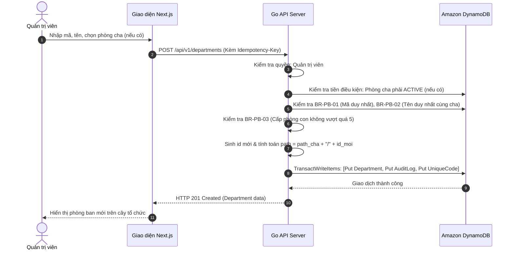
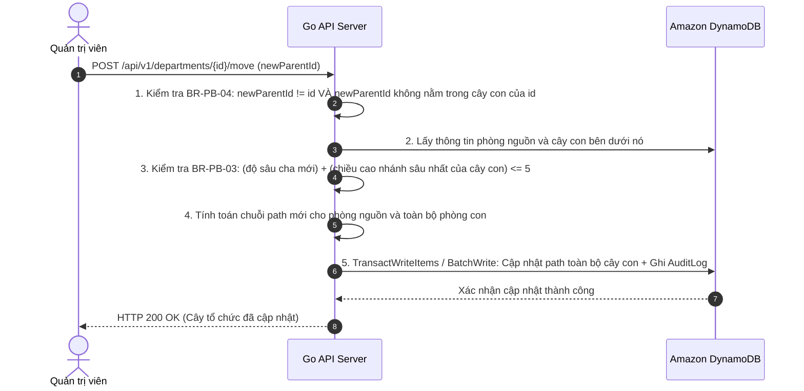

# Đặc Tả Chức Năng — Phân Hệ Quản Lý Phòng Ban (Department Spec)

## 1. Tổng Quan Phân Hệ

Phân hệ Phòng ban chịu trách nhiệm mô hình hóa và quản lý cấu trúc cây tổ chức phân cấp của doanh nghiệp. Hệ thống biểu diễn toàn bộ các đơn vị (Khối, Phòng, Ban, Trung tâm, Tổ, Nhóm) dưới một thực thể thống nhất là **Phòng ban (`Department`)**, với độ sâu tối đa không vượt quá 5 cấp.

Phân hệ cung cấp các khả năng:
- Thiết lập sơ đồ tổ chức dạng cây trực quan.
- Tạo mới, đổi tên, phân cấp cha–con.
- **Di chuyển phòng ban** và tái cấu trúc cây con (*Luồng phức tạp nhất hệ thống*).
- Lưu trữ phòng ban (`ARCHIVED`) bảo toàn lịch sử.
- Bổ nhiệm hoặc chuyển giao vị trí Trưởng phòng.

---

## 2. Danh Mục Quy Tắc Nghiệp Vụ (Business Rules)

Mỗi quy tắc dưới đây là một bất biến của hệ thống và **bắt buộc phải có ít nhất một Unit/Integration Test tương ứng** kiểm chứng:

| Mã quy tắc | Tên quy tắc nghiệp vụ | Mô tả chi tiết & Hành vi hệ thống | Vì sao & Hệ quả kỹ thuật nếu vi phạm |
| :--- | :--- | :--- | :--- |
| **BR-PB-01** | **Mã phòng ban duy nhất & bất biến** | Trường `code` là duy nhất trên toàn công ty. Một khi đã tạo thành công, **tuyệt đối không được phép chỉnh sửa**. | Đảm bảo liên kết ổn định với các hệ thống phụ trợ (chấm công, kế toán, bảng lương) tra cứu theo mã phòng. |
| **BR-PB-02** | **Tên phòng ban duy nhất trong cùng cha** | Trường `name` là duy nhất trong phạm vi cùng một phòng cha. Hai phòng có tên giống nhau (ví dụ: *"Phòng Kế toán"*) nhưng thuộc hai Khối/Cha khác nhau là **hoàn toàn hợp lệ**. | Tránh nhầm lẫn khi người dùng thao tác trực tiếp trên cùng một cấp quản lý con. |
| **BR-PB-03** | **Độ sâu cây tối đa 5 cấp** | Cây tổ chức chỉ cho phép độ sâu từ gốc đến nút lá sâu nhất tối đa là 5 cấp (Gốc = Cấp 1, Lá sâu nhất = Cấp 5). | Ngăn chặn cấu trúc quản lý cồng kềnh, phân mảnh; hạn chế độ dài chuỗi `path` và tối ưu hóa hiệu năng render cây trên giao diện. |
| **BR-PB-04** | **Cấm tạo chu trình đệ quy** | **Tuyệt đối không được phép di chuyển một phòng ban vào chính nó hoặc vào bất kỳ phòng con nào nằm trong cây con của nó.** | **Cạm bẫy chí mạng**: Vi phạm quy tắc này sẽ làm đứt gốc cây tổ chức thành một vòng lặp kín vô tận. Mọi thuật toán duyệt cây, render giao diện sẽ bị treo vô hạn (Infinite Loop/Crash), hàm tính `path` tràn bộ nhớ, và ma trận phân quyền trở nên vô nghĩa. |
| **BR-PB-05** | **Cập nhật `path` đồng bộ toàn cây con** | Khi một phòng ban được di chuyển sang cha mới, chuỗi `path` của chính phòng ban đó và **toàn bộ các phòng ban con ở mọi độ sâu bên dưới** phải được cập nhật lại chuẩn xác. | Trường `path` là căn cứ để kẹp phạm vi truy vấn (Data Scoping). Sót một phòng con chưa cập nhật `path` sẽ khiến phòng đó bị văng khỏi phạm vi quản lý của cấp trên. |
| **BR-PB-06** | **Điều kiện lưu trữ phòng ban** | Không được phép lưu trữ (`ARCHIVED`) một phòng ban nếu phòng đó **vẫn còn nhân viên ở trạng thái `ACTIVE`** hoặc **vẫn còn bất kỳ phòng con nào ở trạng thái `ACTIVE`**. | Đảm bảo không có nhân viên nào bị "mồ côi" phòng ban hoạt động; không để lại nút cha bị lưu trữ trong khi nút con vẫn đang hoạt động. |
| **BR-PB-07** | **Đóng băng phòng ban đã lưu trữ** | Phòng ban ở trạng thái `ARCHIVED` **không được phép tiếp nhận nhân viên mới**, và **không được phép tạo hoặc chuyển phòng con mới vào nó**. | Bản ghi lưu trữ chỉ đóng vai trò bảo lưu lịch sử kiểm toán, không tham gia vào các hoạt động nghiệp vụ hiện hành. |
| **BR-PB-08** | **Ràng buộc nhân sự Trưởng phòng** | Người được bổ nhiệm làm Trưởng phòng (`managerId`) **bắt buộc phải là nhân viên đang ở trạng thái `ACTIVE`** thuộc về **chính phòng ban đó hoặc thuộc một trong các phòng con bên dưới của nó**. | Không cho phép chỉ định một người ở phòng ban xa lạ hoặc đã nghỉ việc làm người đứng đầu quản lý đơn vị. |

---

## 3. Đặc Tả Luồng Nghiệp Vụ Chính

### 3.1. UC-01 · Tạo Phòng Ban Mới

#### Các bước thực hiện:
1. **Người thực hiện**: Quản trị viên (Admin).
2. **Tiền điều kiện**: Nếu có chọn phòng ban cha, phòng cha bắt buộc phải đang ở trạng thái `ACTIVE`.
3. Người dùng nhập tên (`name`), mã (`code`), và chọn phòng cha (`parentId`).
4. Máy chủ Go kiểm tra các quy tắc:
   - `BR-PB-01`: Mã phòng ban chưa tồn tại trong hệ thống.
   - `BR-PB-02`: Tên phòng ban chưa tồn tại trong danh sách các con của `parentId`.
   - `BR-PB-03`: Độ sâu của phòng cha hiện tại < 5 cấp (tức là phòng mới tối đa là cấp 5).
5. Máy chủ Go tự sinh `id` mới và tự động tính toán trường `path`:
   - Nếu là phòng gốc (`parentId` rỗng): `path = "/" + id + "/`.
   - Nếu có phòng cha: `path = parent.path + id + "/`.
6. Máy chủ thực hiện ghi phòng ban mới và bản ghi `AuditLog` (`action = "department.created"`) **trong cùng một transaction nguyên tử DynamoDB (`TransactWriteItems`)**.

#### Tiêu chí nghiệm thu (Acceptance Criteria):
- [ ] Gửi mã `code` đã tồn tại: Bị từ chối với mã lỗi 400/409, thông báo chỉ rõ mã nào bị trùng.
- [ ] Gửi tên `name` trùng trong cùng phòng cha: Bị từ chối.
- [ ] Gửi tên `name` trùng nhưng ở khác phòng cha: Cho phép tạo thành công.
- [ ] Tạo phòng ban ở cấp thứ 6: Bị từ chối.
- [ ] Định dạng `path` chuẩn xác: Bắt đầu và kết thúc bằng ký tự `/`, không thừa thiếu dấu, chứa chính xác chuỗi ID của các cấp cha.
- [ ] Có đúng một bản ghi nhật ký `AuditLog` được ghi kèm cùng thời điểm.

---

### 3.2. UC-02 · Di Chuyển Phòng Ban (Luồng Khó Nhất Của Hệ Thống)

> [!CAUTION]
> **ĐÂY LÀ LUỒNG KHÓ NHẤT CỦA CẢ BÀI.**
> Nếu hệ thống chỉ có thể làm thật chỉn chu một luồng duy nhất, hãy chọn luồng này. Mọi sự sơ suất trong thuật toán duyệt cây hoặc xử lý giao dịch tại đây đều có thể phá hủy cấu trúc dữ liệu hoặc làm sai lệch toàn bộ phạm vi phân quyền của công ty.

#### Các bước thực hiện chi tiết:
1. **Người thực hiện**: Duy nhất Quản trị viên (Admin).
2. **Tiền điều kiện**: Cả phòng ban cần di chuyển (`sourceDept`) và phòng ban cha đích (`targetParent`) đều phải đang ở trạng thái `ACTIVE`.
3. **Kiểm tra chống chu trình (`BR-PB-04`)**:
   - Nếu `targetParent.id == sourceDept.id` -> **TỪ CHỐI NGAY LẬP TỨC**.
   - Kiểm tra nếu `targetParent.path` có chứa chuỗi `"/" + sourceDept.id + "/` (tức là cha mới thực chất là con hoặc cháu của phòng đang chuyển) -> **TỪ CHỐI NGAY LẬP TỨC**.
4. **Kiểm tra độ sâu tối đa sau di chuyển (`BR-PB-03`)**:
   - Xác định độ sâu lớn nhất của nhánh con bên dưới `sourceDept`: `maxSubtreeDepth`.
   - Tính toán độ sâu mới nếu ghép vào `targetParent`: `newMaxDepth = depth(targetParent) + 1 + maxSubtreeDepth`.
   - Nếu `newMaxDepth > 5` -> **TỪ CHỐI TRƯỚC KHI GHI BẤT KỲ THỨ GÌ**.
5. **Cập nhật trường `path` toàn bộ cây con (`BR-PB-05`)**:
   - Tính tiền tố cũ: `oldPrefix = sourceDept.path`.
   - Tính tiền tố mới: `newPrefix = targetParent.path + sourceDept.id + "/`.
   - Với mọi phòng con `child` thuộc cây: `child.path = newPrefix + child.path.trimPrefix(oldPrefix)`.
6. **Ghi nhật ký kiểm toán**:
   - Ghi một bản ghi `AuditLog` với `action = "department.moved"`, trường `before` ghi nhận cha cũ và path cũ, `after` ghi nhận cha mới và path mới.

#### 🧠 Deep-Dive Kỹ Thuật: Vượt Trần DynamoDB Transaction
> **Bước 4 là chỗ để suy nghĩ kiến trúc, không phải chỗ gõ mã vô thức.**
> DynamoDB giới hạn tối đa **100 mục trong một lệnh `TransactWriteItems`**. Trong một công ty thật, một phòng ban cấp khối di chuyển có thể kéo theo 15–30 phòng con và hàng trăm liên kết nhân sự.
> 
> **Quyết Định Thiết Kế Mini HRM:**
> 1. **Kiểm soát kích thước cây con**: Nếu cây con có tổng số phòng ban con cần cập nhật `<= 25` phòng, toàn bộ thao tác cập nhật `path` + ghi `AuditLog` được gom vào duy nhất **một giao dịch `TransactWriteItems`** để đảm bảo tính nguyên tử tuyệt đối (All-or-Nothing).
> 2. **Trường hợp vượt ngưỡng**: Nếu số phòng con lớn hơn ngưỡng transaction của DynamoDB, hệ thống thực hiện cơ chế **Two-Phase Update**:
>    - Chuyển trạng thái phòng nguồn sang `LOCKED_MOVING` để ngăn chặn các thao tác ghi đồng thời.
>    - Chia nhỏ cây con thành các lô nhỏ (`BatchWriteItem` 25 items/lô) cập nhật `path`.
>    - Khi hoàn tất, mở khóa phòng nguồn và ghi `AuditLog`.
>    - Nếu có lỗi giữa chừng, tiến trình rollback khôi phục lại `path` cũ dựa trên snapshot, tuyệt đối không để cây ở trạng thái "nửa vời".

#### Tiêu chí nghiệm thu (Acceptance Criteria):
- [ ] Di chuyển phòng ban vào chính nó: Bị từ chối.
- [ ] Di chuyển phòng ban vào bất kỳ phòng con/cháu nào của nó: Bị từ chối trước khi ghi DB.
- [ ] Nhánh sâu nhất sau khi di chuyển vượt quá 5 cấp: Bị từ chối trước khi ghi DB.
- [ ] Cây con gồm 3 cấp, 12 phòng ban: Toàn bộ 12 phòng ban đều có trường `path` chính xác tuyệt đối sau khi di chuyển.
- [ ] Phạm vi dữ liệu (Scoping) của các Trưởng phòng cấp dưới tự động cập nhật ngay lập tức theo vị trí mới.
- [ ] Cập nhật thất bại giữa chừng: Hệ thống rollback hoàn toàn, không để cây ở trạng thái sai lệch.

---

### 3.3. Các Thao Tác Nghiệp Vụ Khác

#### Sửa tên phòng ban (`Rename Department`):
- **Phân quyền**: Quản trị viên (sửa bất kỳ phòng nào); Trưởng phòng (chỉ được sửa các phòng nằm trong cây con của mình).
- **Quy tắc**: Phải kiểm tra `BR-PB-02` (Tên mới không được trùng với các phòng anh em cùng cha). Ghi nhật ký `AuditLog` trường `name` cũ và mới.

#### Lưu trữ phòng ban (`Archive Department`):
- **Phân quyền**: Duy nhất Quản trị viên.
- **Quy tắc**: Kiểm tra nghiêm ngặt `BR-PB-06`. Nếu phòng ban còn nhân viên đang làm việc (`ACTIVE`) hoặc còn bất kỳ phòng con nào `ACTIVE` -> **Từ chối, liệt kê danh sách nhân sự/phòng con cản trở**.
- Cập nhật `status = "ARCHIVED"`, ghi nhận `AuditLog`. Không xóa bất kỳ dòng nào trong cơ sở dữ liệu.

#### Bổ nhiệm Trưởng phòng (`Assign Manager`):
- **Phân quyền**: Duy nhất Quản trị viên.
- **Quy tắc**: Kiểm tra `BR-PB-08`. Nhân viên được bổ nhiệm phải có `status = ACTIVE` và thuộc chính phòng ban đó hoặc nằm trong cây con bên dưới. Nếu chọn nhân viên thuộc nhánh cây khác -> **Từ chối ngay lập tức**.
