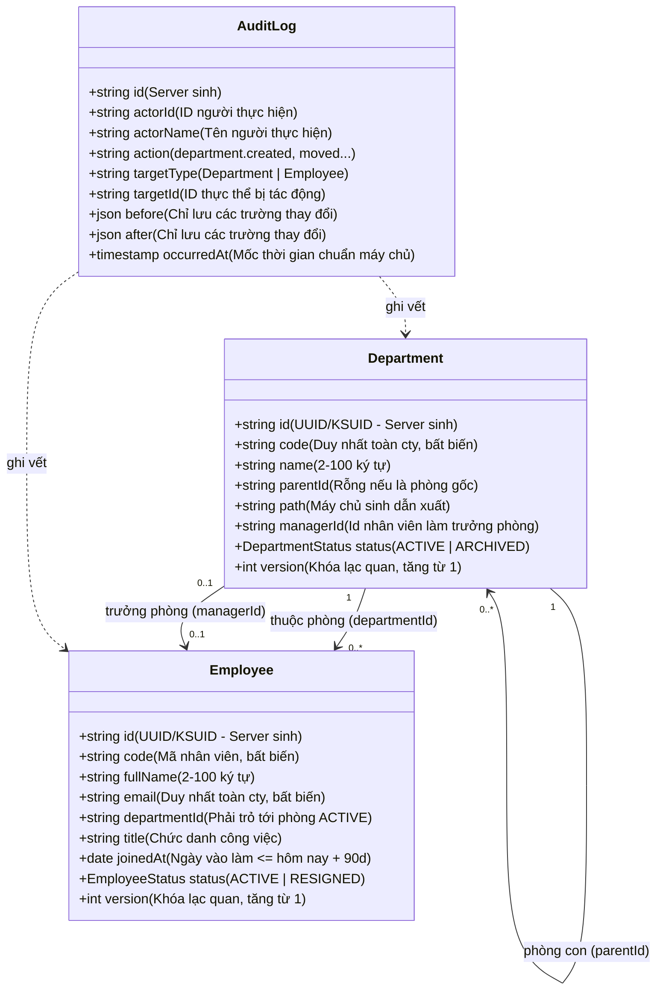
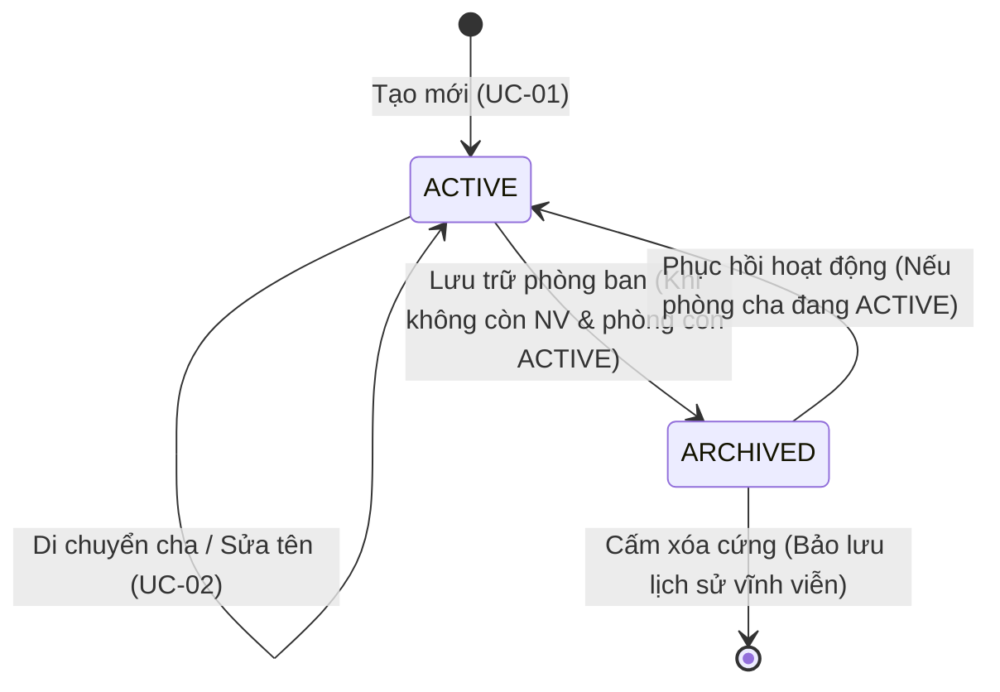
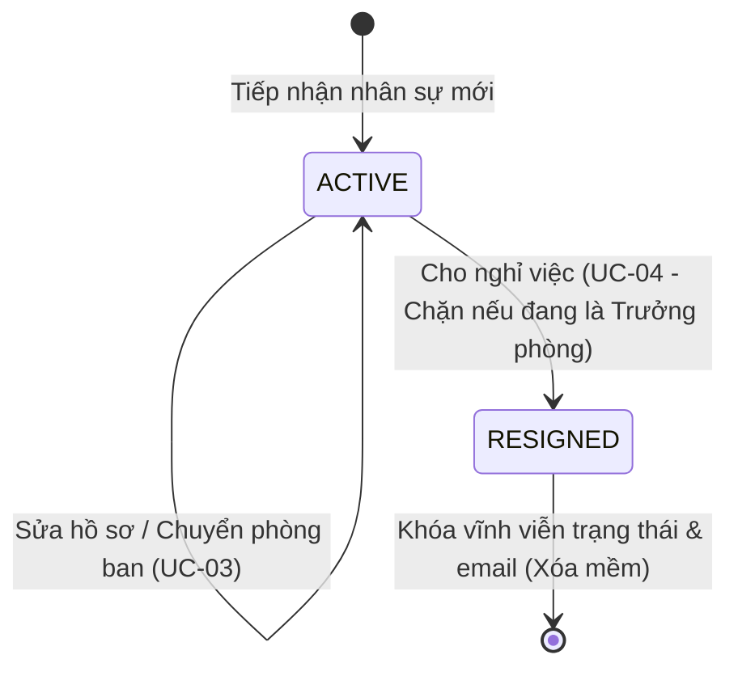

# Đặc Tả Miền Nghiệp Vụ — Domain Specification (Mini HRM)

## 1. Bối Cảnh Nghiệp Vụ & Quy Mô Doanh Nghiệp

Mini HRM được thiết kế để giải quyết bài toán cốt lõi về tổ chức nhân sự cho doanh nghiệp quy mô **200–500 nhân sự**. Cơ cấu tổ chức có dạng hình cây nhiều tầng: **Khối → Phòng → Tổ**.

> Hệ thống này là **nguồn chân lý duy nhất (Single Source of Truth)** trong toàn doanh nghiệp trả lời hai câu hỏi nền tảng:
> 1. *"Công ty đang có những đơn vị nào?"*
> 2. *"Ai đang thuộc đơn vị nào?"*
>
> Mọi hệ thống vận hành mở rộng sau này — từ chấm công, bảng lương, phê duyệt đơn từ, đến cấp phát tài nguyên CNTT — đều sẽ đọc dữ liệu định danh và phân cấp từ hệ thống này.

### Ba Nhóm Người Dùng & Nhu Cầu Tương Tác

| Nhóm người dùng | Họ cần gì (Quyền hạn nhìn thấy & thao tác) | Họ KHÔNG được thấy gì (Ranh giới bảo mật tuyệt đối) |
| :--- | :--- | :--- |
| **Quản trị nhân sự (Admin)** | Dựng và sửa cơ cấu tổ chức toàn công ty; quản lý toàn bộ hồ sơ nhân sự; xem nhật ký kiểm toán. | *(Không có ranh giới cấm — toàn quyền công ty)* |
| **Trưởng phòng (Manager)** | Xem cây con của mình; sửa tên phòng trong cây con; xem và sửa thông tin nhân viên thuộc phòng mình và toàn bộ các phòng con bên dưới. | **Tuyệt đối không được thấy người và phòng ban ở các nhánh khác của cây tổ chức.** |
| **Nhân viên (Employee)** | Xem thông tin phòng ban trực tiếp của mình; xem hồ sơ thông tin cá nhân của chính mình. | **Tuyệt đối không được thấy hồ sơ của bất kỳ nhân viên nào khác trong công ty.** |

> [!IMPORTANT]
> **Cột thứ ba mới là phần khó nhất của hệ thống.**
> Cột thứ hai (*Họ cần gì*) thì bất kỳ ai cũng có thể làm được — nó chỉ là các câu lệnh truy vấn và hiển thị trên giao diện. Cột thứ ba (*Họ KHÔNG được thấy gì*) đòi hỏi kiến trúc hệ thống phải **chứng minh được một điều không bao giờ xảy ra**, và đó là thứ mắt thường không nhìn thấy được trên màn hình, nhưng sẽ lộ ra ngay lập tức khi bị kiểm toán bảo mật hoặc tấn công rà quét.

---

## 2. Ngôn Ngữ Thống Nhất (Ubiquitous Language)

Sử dụng thống nhất các thuật ngữ này trong mã nguồn Go, trong thiết kế DynamoDB, trong API REST và trên giao diện người dùng. Sự lệch pha từ vựng giữa các tầng là nguồn gốc sâu xa của việc hiểu sai nghiệp vụ, và thường chỉ bộc lộ khi hệ thống đã đi vào vận hành.

| Thuật ngữ (English) | Thuật ngữ Tiếng Việt | Định nghĩa & Phạm vi sử dụng nghiệp vụ |
| :--- | :--- | :--- |
| **Department** | **Phòng ban** | Một đơn vị cấu thành cây tổ chức. Trong hệ thống, **không phân biệt khối / phòng / tổ** — về mặt kỹ thuật, chúng là cùng một loại thực thể, chỉ khác nhau ở độ sâu phân cấp trên cây. |
| **Parent / Child** | **Phòng cha · phòng con** | Mối quan hệ trực tiếp một cấp giữa hai phòng ban lân cận trong cây tổ chức (`child.parentId = parent.id`). |
| **Subtree** | **Cây con** | Một phòng ban cụ thể và **toàn bộ các phòng ban nằm trực tiếp hoặc gián tiếp bên dưới nó**, ở mọi độ sâu. |
| **Path** | **Đường dẫn phân cấp** | Chuỗi định danh dẫn xuất từ gốc tới chính phòng ban đó (Ví dụ: `/cong-nghe/backend/api/` hoặc `#id_goc#id_cha#id_con#`). Do máy chủ Go tự sinh, máy khách không được tự ý sửa. |
| **Scope** | **Phạm vi dữ liệu** | Tập hợp dữ liệu phòng ban và nhân sự mà một tài khoản được phép chạm tới. Phạm vi được suy ra động từ vai trò và vị trí hiện tại trong cây, **tuyệt đối không lưu chết trong JWT token**. |
| **Archived** | **Lưu trữ** | Trạng thái ngừng hoạt động một phòng ban nhưng vẫn giữ lại bản ghi và toàn vẹn dữ liệu lịch sử. **Không phải là xóa**. |
| **Resigned** | **Nghỉ việc** | Trạng thái công tác cuối cùng của nhân sự đã thôi việc. Giữ nguyên bản ghi hồ sơ và khóa vĩnh viễn email. **Không phải là xóa**. |
| **Version** | **Phiên bản** | Số nguyên dương đếm tăng dần (`1, 2, 3...`) mỗi khi bản ghi có thay đổi. Sử dụng cho cơ chế khóa lạc quan (Optimistic Concurrency Control) ngăn chặn ghi đè dữ liệu ngầm. |

---

## 3. Mô Hình Thực Thể Miền (Domain Model)

---

## 4. Chi Tiết Thực Thể & Thuộc Tính

### 4.1. Thực thể Phòng ban (`Department`)

| Thuộc tính | Kiểu dữ liệu | Bắt buộc | Ràng buộc nghiệp vụ & Quy tắc kỹ thuật |
| :--- | :--- | :---: | :--- |
| **id** | Chuỗi (String) | ✔ | Máy chủ Go tự sinh (KSUID hoặc UUIDv7 đảm bảo thứ tự thời gian), bất biến vĩnh viễn. |
| **code** | Chuỗi (String) | ✔ | Mã định danh nghiệp vụ (ví dụ `TECH_BE`). Duy nhất trên toàn công ty, **bất biến sau khi tạo**. |
| **name** | Chuỗi (String) | ✔ | Tên phòng ban, độ dài từ 2 đến 100 ký tự. Duy nhất trong cùng một phòng cha (`BR-PB-02`). |
| **parentId** | Chuỗi (String) | — | Trỏ tới `id` của phòng ban cha. Để trống/rỗng nếu là phòng ban gốc (Root). |
| **path** | Chuỗi (String) | ✔ | **Trường dẫn xuất**: Máy chủ tự động sinh và cập nhật. Nếu máy khách gửi lên thì bỏ qua. |
| **managerId**| Chuỗi (String) | — | `id` của nhân viên giữ vai trò Trưởng phòng. Rỗng nghĩa là vị trí trưởng phòng đang khuyết. |
| **status** | Enum | ✔ | `ACTIVE` (Đang hoạt động) hoặc `ARCHIVED` (Đã lưu trữ). |
| **version** | Số nguyên (Int) | ✔ | Bắt đầu từ 1, tự động tăng thêm 1 ở mỗi lần ghi/cập nhật thành công. |

> [!WARNING]
> **Trường `path` là vị trí dễ làm sai nhất trong toàn bộ mô hình dữ liệu.**
> `path` là dữ liệu phái sinh (dẫn xuất) — về mặt toán học nó hoàn toàn suy ra được từ `parentId`. Việc lưu trực tiếp `path` vào cơ sở dữ liệu là một **sự đánh đổi có chủ ý**: chấp nhận rủi ro sai lệch dữ liệu nếu cập nhật lỗi, để đổi lấy khả năng **truy vấn toàn bộ cây con chỉ bằng một lần gọi (Single Query)** thông qua tiền tố `begins_with(path, prefix)`. 
> Đánh đổi này chỉ đúng khi và chỉ khi **mọi đường ghi/di chuyển đều cập nhật lại toàn bộ cây con** — sót một đường dẫn là toàn bộ cây phân cấp bắt đầu "nói dối".

### 4.2. Thực thể Nhân viên (`Employee`)

| Thuộc tính | Kiểu dữ liệu | Bắt buộc | Ràng buộc nghiệp vụ & Quy tắc kỹ thuật |
| :--- | :--- | :---: | :--- |
| **id** | Chuỗi (String) | ✔ | Máy chủ Go sinh, bất biến vĩnh viễn. |
| **code** | Chuỗi (String) | ✔ | Mã nhân viên (ví dụ `EMP-001`). Duy nhất toàn công ty, bất biến sau khi tạo. |
| **fullName** | Chuỗi (String) | ✔ | Họ và tên đầy đủ, độ dài từ 2 đến 100 ký tự. |
| **email** | Chuỗi (String) | ✔ | Email công vụ, duy nhất toàn công ty. **Bảo lưu vĩnh viễn kể cả khi nhân viên đã nghỉ việc** (`BR-NV-01`). |
| **departmentId**| Chuỗi (String)| ✔ | Phải trỏ tới một phòng ban đang ở trạng thái `ACTIVE`. |
| **title** | Chuỗi (String) | — | Chức danh chuyên môn (ví dụ: Senior Backend Engineer). |
| **joinedAt** | Ngày (Date) | ✔ | Ngày chính thức vào làm. Không được muộn hơn hôm nay quá 90 ngày (`BR-NV-06`). |
| **status** | Enum | ✔ | `ACTIVE` (Đang làm việc) hoặc `RESIGNED` (Đã nghỉ việc). |
| **version** | Số nguyên (Int) | ✔ | Khóa lạc quan, bắt đầu từ 1, tăng dần theo mỗi lần cập nhật. |

### 4.3. Thực thể Bản ghi Nhật ký (`AuditLog`)

| Thuộc tính | Kiểu dữ liệu | Ý nghĩa & Quy tắc lưu trữ |
| :--- | :--- | :--- |
| **actorId** · **actorName** | Chuỗi (String) | Ai là người thực hiện thao tác (chụp từ phiên làm việc thực tế). |
| **action** | Chuỗi (String) | Định danh hành động: `department.created`, `department.moved`, `employee.transferred`, v.v. |
| **targetType** · **targetId**| Chuỗi (String) | Đối tượng bị tác động (`Department` hoặc `Employee`) cùng ID tương ứng. |
| **before** · **after** | JSON Object | Ảnh chụp giá trị trước và sau thao tác — **chỉ ghi nhận những trường có sự thay đổi thật sự**. |
| **occurredAt** | Timestamp | Mốc thời gian chính xác của máy chủ (ISO 8601 UTC). |

> [!CAUTION]
> **Nhật ký là sổ cái chỉ ghi thêm (Append-only).**
> Không có API sửa, không có lệnh xóa. Một bảng nhật ký có thể chỉnh sửa được là một bảng nhật ký không còn giá trị chứng minh pháp lý và kiểm toán khi xảy ra sự cố.

---

## 5. Thiết Kế Amazon DynamoDB Single-Table Design

Thay vì tạo nhiều bảng riêng lẻ rồi thực hiện quét (`Scan`) và nối (`Join`) trong bộ nhớ máy chủ, Mini HRM gom toàn bộ các thực thể vào **một bảng duy nhất** (`mini_hrm_table`) với chỉ mục chính và 1 Global Secondary Index (GSI):

### Cấu Trúc Khóa Của Bảng Chính & GSI1

| Kiểu truy vấn nghiệp vụ | Partition Key (`PK`) | Sort Key (`SK`) | GSI1PK | GSI1SK |
| :--- | :--- | :--- | :--- | :--- |
| **Phòng ban theo ID** | `DEPT#<dept_id>` | `METADATA` | `DEPT_PARENT#<parentId>` | `PATH#<path>` |
| **Tìm phòng ban theo Mã** | `DEPT_CODE#<code>` | `METADATA` | — | — |
| **Nhân viên theo ID** | `EMP#<emp_id>` | `METADATA` | `DEPT#<departmentId>` | `EMP#<emp_id>` |
| **Tìm nhân viên theo Email** | `EMP_EMAIL#<email>` | `METADATA` | — | — |
| **Nhật ký kiểm toán** | `AUDIT#<targetId>` | `LOG#<occurredAt>#<log_id>`| `ACTOR#<actorId>` | `TIME#<occurredAt>` |

### Khả Năng Đáp Ứng Truy Vấn:
1. **Lấy thông tin một phòng ban**: `GetItem(PK = "DEPT#123", SK = "METADATA")` -> Độ trễ dưới 5ms.
2. **Lấy danh sách phòng con trực tiếp**: `Query(GSI1, GSI1PK = "DEPT_PARENT#123")`.
3. **Lấy toàn bộ nhân viên trong một phòng ban**: `Query(GSI1, GSI1PK = "DEPT#123")`.
4. **Kiểm tra trùng mã phòng ban / email nhân viên**: `GetItem` trực tiếp vào partition bảo vệ `DEPT_CODE#<code>` hoặc `EMP_EMAIL#<email>` với chi phí tối thiểu.

---

## 6. Máy Trạng Thái Thực Thể (State Machines)

### 6.1. Vòng đời Phòng ban (`Department`)

### 6.2. Vòng đời Nhân viên (`Employee`)

